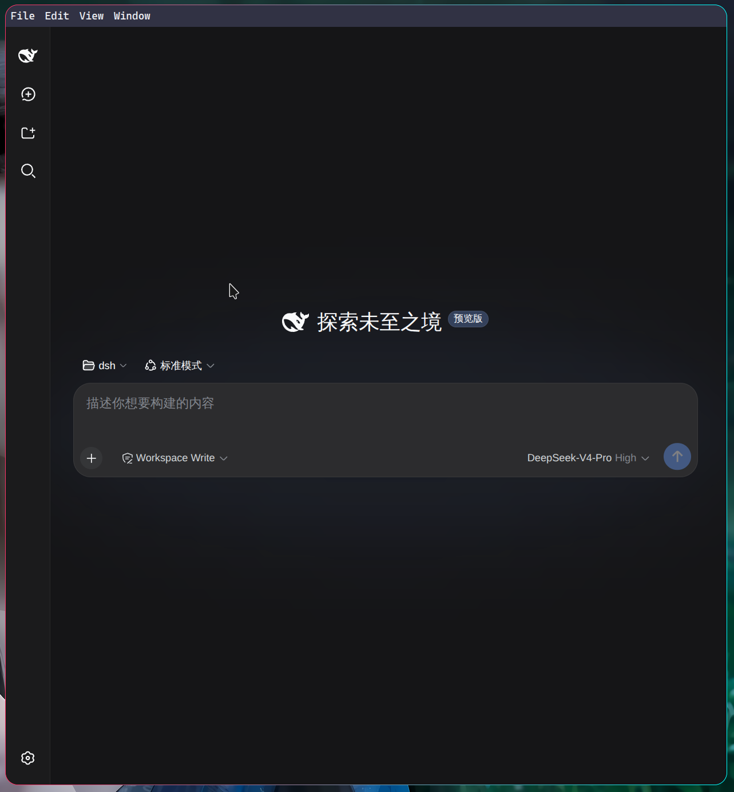
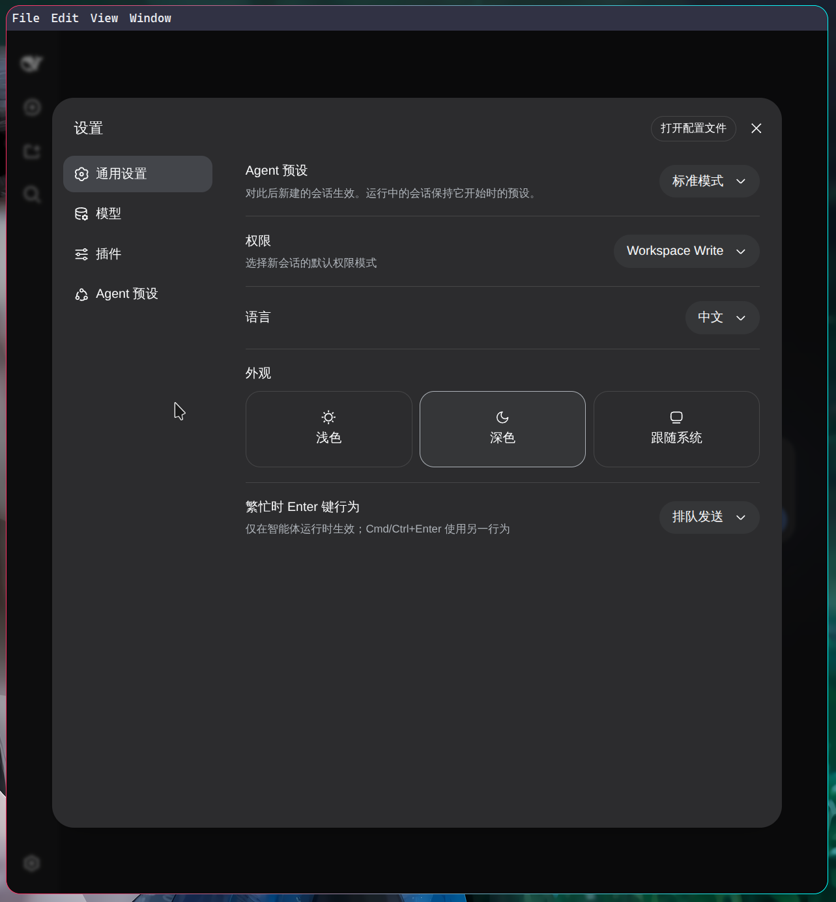

# DeepSeek Harness — Desktop (Linux)

一个把 [DeepSeek Harness](https://github.com/deepseek-ai/deepseek-harness) 的 Web 界面
(`dsh web`) 打包成**自包含、双击即用**的 Linux 桌面应用。

- 内置 `@deepseek-ai/dsh` 运行时、前端资源，以及一套 **Node 22 运行时**，**无需**预先安装 `dsh` / Node / pnpm。
- 启动时在后台用内置 Node 拉起 `dsh web` 服务，再打开一个原生窗口指向该 GUI。
  （不用 Electron 自带的 Node 24：`dsh` 面向 Node 22 构建，且 `sharp` 等原生模块
  在 Electron 的 Node 24 下会崩溃，因此单独捆绑 Node 22 运行时。）
- 产出物为单个 `.AppImage`，双击即可运行。

## 目录结构

```
desktop/
  main.js            Electron 主进程：用内置 Node 拉起 dsh web 服务 + 打开窗口 + 生命周期管理
  preload.js         最小化预加载脚本（沙箱开启、无 Node 暴露）
  vendor/node/       捆绑的 Node 22 运行时（仅 bin/node + LICENSE，构建时作为 extraResources 打进包内）
  assets/            应用图标与加载页
  scripts/           桌面集成脚本
  dist/              electron-builder 产物（构建后生成）
```

## 构建

需要 Node.js 22+ 与 npm。首次构建会下载 Electron 二进制、appimagetool，以及 Node 22 运行时
（`vendor/node`，由 `scripts/fetch-node-runtime.sh` 下载/解压；国内可配置镜像加速）。

```bash
cd desktop
npm install

# 国内网络可先设置镜像再构建：
#   export ELECTRON_MIRROR=https://npmmirror.com/mirrors/electron/
#   export ELECTRON_BUILDER_BINARIES_MIRROR=https://npmmirror.com/mirrors/electron-builder-binaries/

# 本地调试（以桌面窗口方式启动）
npm start

# 打包 AppImage（Linux 便携单文件）
npm run dist:appimage
```

产物位于 `desktop/dist/DeepSeek-Harness-<version>-<arch>.AppImage`。

## 一键安装到桌面（可选）

```bash
chmod +x scripts/install-desktop-entry.sh
./scripts/install-desktop-entry.sh
```

脚本会把 AppImage 复制到 `~/.local/bin`、安装图标，并写入
`~/.local/share/applications/deepseek-harness.desktop`，之后即可在应用启动器里点击启动。

## 行为说明

- 应用使用 `~/.dsh` 作为 Harness 数据目录（与命令行版共享凭据、设置与会话）。
  首次启动会自动初始化 `web` profile。
- Web 服务绑定 `127.0.0.1`，端口由系统自动分配，避免与已运行的 `dsh web` 冲突。
- 服务日志写在 `~/.config/deepseek-harness-desktop/dsh-web.log`（`userData` 目录下）。
- 仅允许单实例运行；再次启动会聚焦到已打开的窗口。
- 关闭窗口即停止内置服务进程。

## 平台

当前仅面向 Linux（`AppImage`）。如需 Windows / macOS，可复用同一套
`main.js`/`preload.js`，在对应平台执行 `electron-builder` 对应 target（macOS 建议
在 macOS 上构建）。



